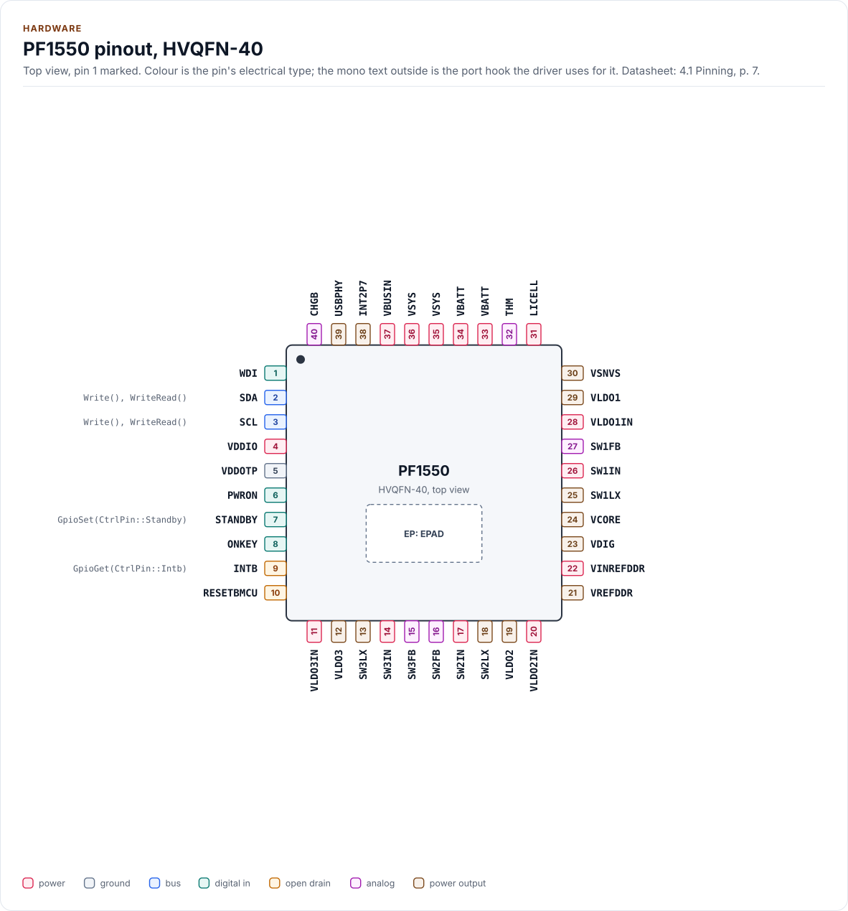
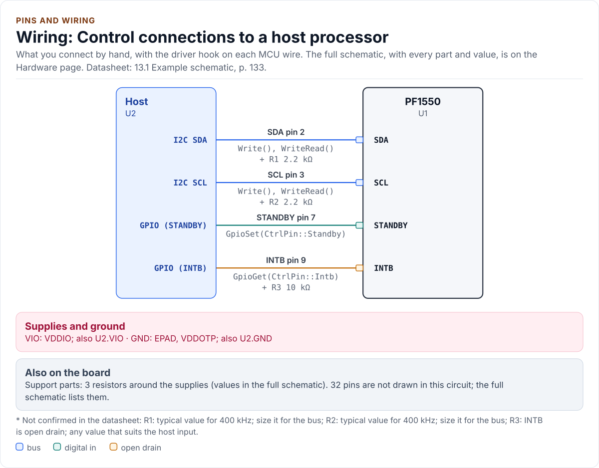
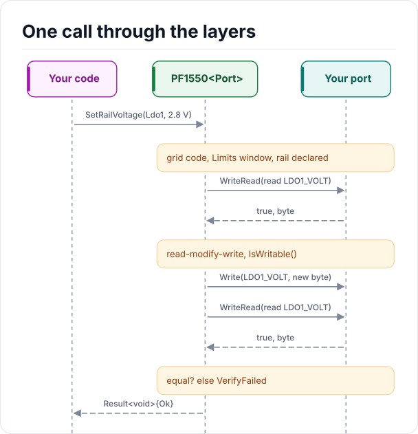

# Figures

<!-- Written by kokeb-docs figures from docs/diagrams/figures/*.py. Do not edit by hand. -->

Every figure on this site is drawn by a Python module from facts extracted from the code, so it is rebuilt,
not redrawn, when the code changes. CI runs `kokeb-docs figures --check` and fails when a
committed figure no longer matches the code. Each figure below lists the files it is drawn from.

## Inside the PF1550

<!-- figure: chip-blocks -->
<picture>
  <source media="(prefers-color-scheme: dark)" srcset="chip-blocks.dark.svg">
  
</picture>
<!-- /figure -->

Hardware description: [`docs/hardware.yml`](../hardware.yml)

Drawn from:

- [`docs/hardware.yml`](../hardware.yml)
- [`inc/pf1550_i2c_interface.hpp`](../../inc/pf1550_i2c_interface.hpp)

## What the PF1550 does

<!-- figure: chip-capabilities -->
<picture>
  <source media="(prefers-color-scheme: dark)" srcset="chip-capabilities.dark.svg">
  
</picture>
<!-- /figure -->

Hardware description: [`docs/hardware.yml`](../hardware.yml)

Drawn from:

- [`docs/hardware.yml`](../hardware.yml)
- [`inc/pf1550_i2c_interface.hpp`](../../inc/pf1550_i2c_interface.hpp)

## PF1550: Control connections to a host processor

<!-- figure: chip-circuit-typical -->
<picture>
  <source media="(prefers-color-scheme: dark)" srcset="chip-circuit-typical.dark.svg">
  
</picture>
<!-- /figure -->

Hardware description: [`docs/hardware.yml`](../hardware.yml)

Drawn from:

- [`docs/hardware.yml`](../hardware.yml)
- [`inc/pf1550_i2c_interface.hpp`](../../inc/pf1550_i2c_interface.hpp)

## PF1550

<!-- figure: chip-hero -->
<picture>
  <source media="(prefers-color-scheme: dark)" srcset="chip-hero.dark.svg">
  
</picture>
<!-- /figure -->

Hardware description: [`docs/hardware.yml`](../hardware.yml)

Drawn from:

- [`docs/hardware.yml`](../hardware.yml)
- [`inc/pf1550_i2c_interface.hpp`](../../inc/pf1550_i2c_interface.hpp)

## PF1550 package, HVQFN-40

<!-- figure: chip-outline -->
<picture>
  <source media="(prefers-color-scheme: dark)" srcset="chip-outline.dark.svg">
  
</picture>
<!-- /figure -->

Hardware description: [`docs/hardware.yml`](../hardware.yml)

Drawn from:

- [`docs/hardware.yml`](../hardware.yml)
- [`inc/pf1550_i2c_interface.hpp`](../../inc/pf1550_i2c_interface.hpp)

## PF1550 pinout, HVQFN-40

<!-- figure: chip-pinout -->
<picture>
  <source media="(prefers-color-scheme: dark)" srcset="chip-pinout.dark.svg">
  
</picture>
<!-- /figure -->

Hardware description: [`docs/hardware.yml`](../hardware.yml)

Drawn from:

- [`docs/hardware.yml`](../hardware.yml)
- [`inc/pf1550_i2c_interface.hpp`](../../inc/pf1550_i2c_interface.hpp)

## Wiring: Control connections to a host processor

<!-- figure: chip-wiring-typical -->
<picture>
  <source media="(prefers-color-scheme: dark)" srcset="chip-wiring-typical.dark.svg">
  
</picture>
<!-- /figure -->

Hardware description: [`docs/hardware.yml`](../hardware.yml)

Drawn from:

- [`docs/hardware.yml`](../hardware.yml)
- [`inc/pf1550_i2c_interface.hpp`](../../inc/pf1550_i2c_interface.hpp)

## The layers, one of them yours

<!-- figure: driver-layers -->
<picture>
  <source media="(prefers-color-scheme: dark)" srcset="driver-layers.dark.svg">
  
</picture>
<!-- /figure -->

Figure module: [`docs/diagrams/figures/driver-layers.py`](../../docs/diagrams/figures/driver-layers.py)

Drawn from:

- `public calls` in [`inc/pf1550.hpp`](../../inc/pf1550.hpp)
- `I2cInterface` in [`inc/pf1550_i2c_interface.hpp`](../../inc/pf1550_i2c_interface.hpp)

## One register read on the I2C bus

<!-- figure: i2c-register-read -->
<picture>
  <source media="(prefers-color-scheme: dark)" srcset="i2c-register-read.dark.svg">
  
</picture>
<!-- /figure -->

Hardware description: [`docs/model/i2c-register-read.seq.yml`](../model/i2c-register-read.seq.yml)

Drawn from:

- [`docs/model/i2c-register-read.seq.yml`](../model/i2c-register-read.seq.yml)

## One call through the layers

<!-- figure: one-call-through-the-layers -->
<picture>
  <source media="(prefers-color-scheme: dark)" srcset="one-call-through-the-layers.dark.svg">
  
</picture>
<!-- /figure -->

Hardware description: [`docs/model/one-call-through-the-layers.seq.yml`](../model/one-call-through-the-layers.seq.yml)

Drawn from:

- [`docs/model/one-call-through-the-layers.seq.yml`](../model/one-call-through-the-layers.seq.yml)
